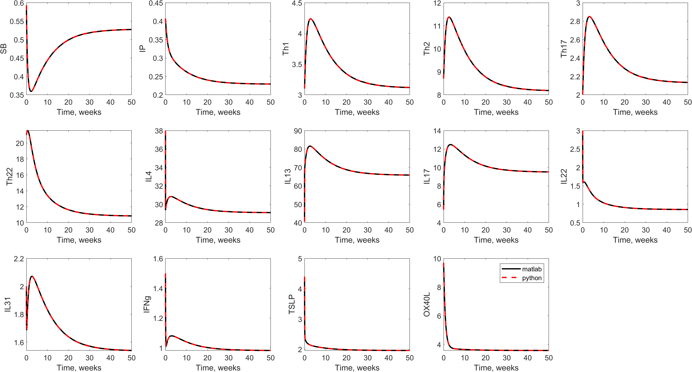
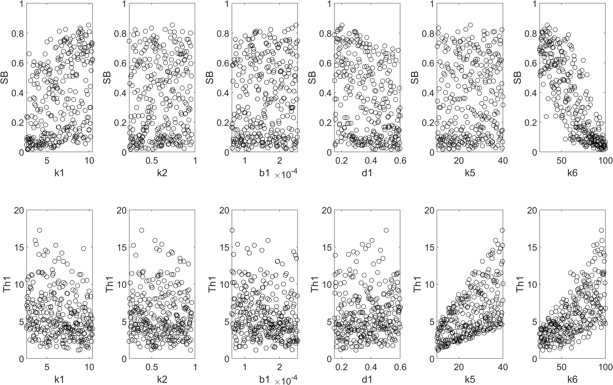
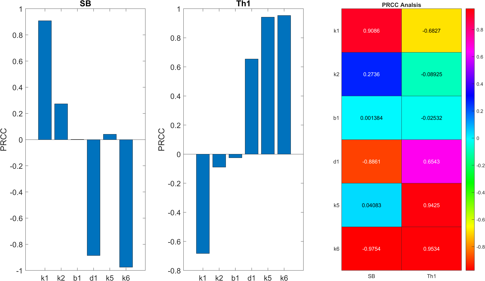
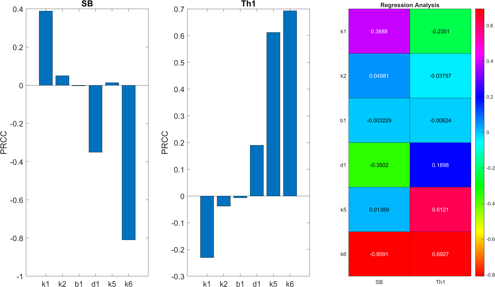
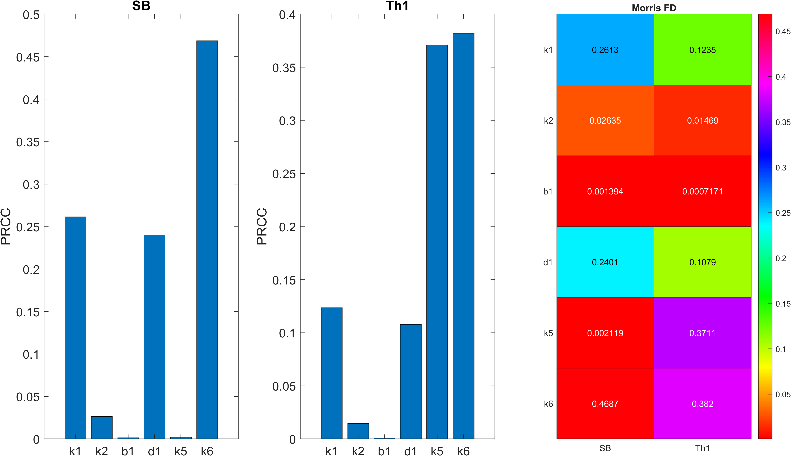

## Comparision of the MATAB results to original python script

## Brief Description of Sensitivity Analysis results

# Scatter plot of SB and Th1 against different parameters 

# SA based on PRCC

# SA based on Linear regression

# Morris Finited Difference based sensitvity analysis 

